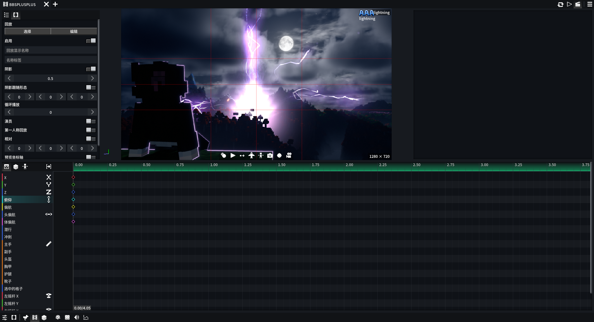

# BBS++

> [BBSFS](https://github.com/Wemppy4/bbs-fs) 功能增强插件

  

## 功能一览

### 可配置项

| 功能                   | 默认 | 说明                                                                                                                         |
| ---------------------- | ---- | ---------------------------------------------------------------------------------------------------------------------------- |
| **BBS增强**      |      |                                                                                                                              |
| 中文关键帧轨道名称     | 关   | 将关键帧编辑器中的轨道名称显示为中文。可通过修改语言文件`bbspp.keyframe.*` 添加/修改翻译，硬编码表兜底                     |
| 编辑器自动切换旁观模式 | 关   | 打开影片编辑器时自动切换到旁观模式，关闭时恢复。                                                                             |
| 禁止出现负数关键帧     | 关   | 开启后，禁止在关键帧编辑器中将关键帧拖动或添加到0秒之前                                                                      |
| Shift直接选择父级      | 关   | 开启后，按住 Shift 在"回放编辑器"、“模型编辑器”中点击模型部位时，将不再弹出层级选择菜单，而是直接选中其父骨骼。            |
| 姿势骨骼树形列表       | 关   | 开启后，姿势编辑器的骨骼列表会按模型父子层级缩进并绘制树形连接线；搜索时仍平铺显示匹配项                                     |
| 第一人称视角晃动       | 关   | 开启后，在播放`第一人称回放` 时，会还原原版的行走视角晃动效果                                                              |
| 全新伪装界面布局       | 关   | 开启后，伪装界面将使用全新的双栏布局。关闭后将使用原版垂直布局                                                               |
| 全新影片库界面         | 关   | 开启后，影片选择界面将使用新版影片库布局和交互                                                                               |
| 反转时间线滚轮方向     | 关   | 开启后，反转影片编辑器中滚轮驱动的时间线方向，包括Ctrl+滚轮移动播放头、Alt+滚轮移动选中关键帧或剪辑，以及Alt滚轮左右滚动时间 |
| 光影控制按钮           | 关   | 在`影片编辑器` 中添加了一个按钮，左键开/关，右键打开`光影选择界面`                                                      |
| 新光影曲线选择界面     | 关   | 开启后，在曲线剪辑里添加光影曲线时使用按光影设置分类的新界面。关闭后使用 BBS 原版平铺列表                                    |
| 关键帧布局深度锁定     | 关   | 开启后，如果`关键帧编辑器` 布局被锁定，左侧轨道名称和右侧轨道之间的调节柄也会隐藏，不再允许调节宽度                        |
| 世界播放应用光影曲线   | 关   | 开启后，使用右Ctrl在世界内播放影片时，曲线剪辑里的太阳、天气、天空色以及Iris光影包参数也会生效                               |
| 允许拖动扩展剪辑轨道   | 关   | 开启后，将整段剪辑继续拖到时间线顶部之外时不再限制轨道层级，可以像原版 BBS 一样创建更多轨道                                  |
| 使用 BBS++ 专用剪贴板  | 关   | 开启后，回放、关键帧、形态、变换等 BBS 专用复制数据会保存在 BBS++ 内部，不再写入系统剪贴板                                   |
| Alt滚轮时间线行为      | 默认 | 设置影片编辑器关键帧视图中，未选中关键帧时按住Alt滚动鼠标滚轮的行为                                                          |
| **物品喷射**     |      |                                                                                                                              |
| 视野外停止渲染         | 开   | 开启后，物品喷射粒子离开玩家视野时会跳过物品渲染，降低大量粒子时的帧率压力                                                   |
| 最大渲染距离           | 0    | 超过该距离的物品喷射粒子会跳过渲染。设为0时自动跟随客户端视距                                                                |
| 每帧最大渲染数量       | 1024 | 限制每帧最多绘制多少个物品喷射粒子。设为0时不限制                                                                            |
| IRL阴影最大物品数      | 1024 | 开启IRLights光源阴影时，限制最多多少个物品喷射粒子参与投影。设为0时禁用物品喷射投影                                          |
| **Gizmo 改版**   |      |                                                                                                                              |
| Blockbench 风味 Gizmo  | 关   | 开启后Gizmo 显示模式默认改为平移， G/S/R 仅切换 Gizmo 显示模式（无编辑），T 键循环切换模式只切换平移、缩放、旋转            |
| T 键循环含组合模式     | 关   | 使 T 键循环包含 组合Gizmo。仅在上方选项开启时生效                                                                            |
| 保留原版快捷键功能     | 关   | 第 2 次按 G/S/R 不恢复模式，而是执行原版快捷键功能。仅在上方选项开启时生效                                                   |

### AAA粒子

> 前置依赖：需安装 `aaa_particles-2.2.0` + `architectury`，未安装则自动禁用该功能

- 新增 AAA 粒子伪装，粒子文件需存放至 `assets/effeks/` 目录
- 新增指令：`/bbsplusplus aaa_particle trigger <x> <y> <z> <触发器ID>`
  - 示例：`/bbsplusplus aaa_particle trigger 100 64 200 0`（触发指定坐标模型方块粒子的「触发器 0」）
- 已知限制与说明：
  - 功能已通过基础稳定性测试（无崩溃），非崩溃级 BUG 可能不再维护（当前版本已经满足自用需求）
  - 若加载粒子后游戏崩溃：尝试用新版 `Effekseer` 重新导出；如果仍崩溃那我也没招了（

### 物品喷射

* 新增 物品喷射 伪装，可以选择多种物品喷射，支持调整的参数如下
  * 物品、数量、频率、存活时间、射程、半径、速度、速度散布、位置散布、重力、碰撞、重力速度、实时模式、模拟时间、随机种子、始终面向镜头、物品俯仰、物品偏航、物品横滚、X轴旋转速度、Y轴旋转速度、Z轴旋转速度、随机旋转速度、缩放、缩放散布、显示辅助线、颜色、发射器形状

### Pose帧增强

- 增加 `pose` 帧多选粘贴功能
- 增加 `骨骼参数刷`，可以复制骨骼参数到另一个骨骼
- 增加 `改动骨骼标识`，有改动的骨骼会有橙色菱形标识提示
- 增加 `跳过当前帧骨骼关键值` ，将鼠标移到骨骼名称右侧边缘会出现菱形，点击即可切换。跳过后仍会保留该骨骼在当前帧的参数，但动画计算会忽略此关键值，直接在前后有效 Pose 帧之间插值；灰色斜线菱形表示已跳过。
- 移植 FS2.5 版本的 `树形骨骼` 功能并优化显示，可选项，默认关

### 结构伪装：

> 合并自 `卫巾纸薄`的`tools`插件

- 增加结构棒、结构伪装
- 后续++会完善：操作优化、群系

### 视频伪装：

> 前置依赖：需安装`MediaPlayer-BBS`，未安装则自动禁用该功能，仅支持**Windows x64**平台！

- 等待后续完善

### 原版增强

| 功能                         | 说明                                                 |
| ---------------------------- | ---------------------------------------------------- |
| 动画转姿势搜索框             | 动画转姿势窗口添加动画搜索框                         |
| 音效选择器树形列表           | 音效选择器界面以树形结构展示，方便浏览               |
| 双击剪辑编辑(NYK)            | 时间轴上双击剪辑就能进入编辑界面                     |
| 发光色度方块（NYK）          | 添加发光色度方块                                     |
| IRLights插件汉化             | IRLights插件的汉化                                   |
| 改进纹理管理器               | 增加网格模式，增加缩略图                             |
| vfx插件汉化、增强            | vfx插件的汉化、增强                                  |
| 回放类别操作优化             | 增加多选拖拽、重命名类别                             |
| 撤销记录面板改进             | 撤销记录面板显示更易读的操作摘要，并扩大历史弹窗宽度 |
| 光影曲线选择界面改进         | 嗯...                                                |
| 屏蔽ctrl+B打开复述功能       | 莫名其妙的mojang                                     |
| 补全原版图片伪装功能         | 补全UV偏移                                           |
| 光影曲线轨道名称优化         | 合并自tools插件                                      |
| 增加日月偏角和焦点曲线关键帧 | 合并自tools插件                                      |
| ItemStack轨道改进            | 增加变换功能                                         |

### 原版修复

| 功能                  | 说明                                                                                      |
| --------------------- | ----------------------------------------------------------------------------------------- |
| 输入法冲突修复        | 兼容 IMBlocker，修复在BBS界面下无法切换中文的问题                                         |
| 曲线崩溃修复          | 修复 BBS 2.2 曲线剪辑中开启飞行模式时游戏崩溃的bug                                        |
| 飞行模式曲线修复(NYK) | 打开飞行模式后曲线关键帧的修改依旧生效                                                    |
| 时间轴标尺遮挡修复    | 修复时间轴标尺遮挡导致的关键帧/剪辑片段仍然能被点击的问题                                 |
| 拖动剪辑片段修复      | 修复BBSFS中部分情况下拖动剪辑片段回弹/卡住的问题                                          |
| 播放头偏左问题修复    | 解决wemppy弹道偏左的问题                                                                  |
| 模型贴图错误修复      | 修复在模型贴图名称和模型名称不一致时，BBS可能会使用`_S`等后缀贴图当作默认模型贴图的问题 |
| 颜色膨胀问题修复      | 嗯......                                                                                  |
| 修复光影曲线          | 合并自tools插件，并修复了tools存在的问题                                                  |
| 屏蔽BBS F10黑板功能   | 嗯.........                                                                               |
| 静音问题修复          | 切换音频输出设备时，BBS会出现静音问题                                                     |
| 修复关键帧色条断开    | BBS关键帧相同参数色条会断开                                                               |

## 开源许可

- 本项目以 **GNU LGPL-3.0-or-later** 许可证开源，完整许可证文本见 [LICENSE](LICENSE)
- 你可以自由使用、学习、修改和分发本项目，修改后的衍生作品需同样遵循 LGPL-3.0 及其后续版本开源
- 版权所有 (C) Gbeic
- 本项目是 [BBSFS](https://github.com/Wemppy4/bbs-fs) 的扩展插件，通过 Mixin 实现增强

### MOD更新日志

#### 2.6.3：

* 新增 `视频伪装` ，依赖前置mod `MediaPlayer-BBS`，目前还有操作方面待完善，仅支持**Windows x64**平台！
* 补全irl 1.1.5版本汉化
* 删除vfx汉化，因为本体已经有了汉化版本
* 补全vfx和vfxlight的关键帧轨道汉化
* 修复vfx着色器报错
* 修复++破坏魔杖改进在新版vfx失效的问题
* 修复vfx和物品喷射冲突的问题

#### 2.6.2：

- 改进 `pose` 帧：增加跳过骨骼当前帧功能
- 优化 `pose` 帧骨骼列表滚动
- 规范化 `/bbsplusplus` 指令
- 改进VFX插件的 `破坏魔杖`操作体验，不拿起时隐藏预览框
- 修复关键帧相同参数色条断开的问题
- 优化++新UI的`默认打开`功能的保存逻辑
- 重构物品喷射伪装
- 屏蔽BBS F10黑板功能
- 增加音频输出设备切换监听，避免切换设备后bbs出现静音的问题
- 增加BBS设置>视频录制界面的视频预设功能

#### 2.6.1：

- 改进 `pose` 帧：增加多选粘贴功能
- 更正关键帧轨道翻译
- 再次修复颜色数组膨胀问题

#### 2.6.0：

- 改进 `pose` 帧
  - 增加 `骨骼参数刷`功能。可以复制骨骼参数到另一个骨骼
  - 增加 `改动骨骼标识`，有改动的骨骼会有橙色菱形标识提示
  - 把FS2.5版本的 `树形骨骼` 功能移植到插件中，并优化显示，可选项，默认关

#### 2.5.9：

- 解决泠风反馈的一个神秘崩溃BUG（他的端太神秘了
- 增加UV偏移功能、顺带补全图片伪装的UV偏移
- 增加alt选中剪辑、关键帧的方向反转到`反转时间线滚轮方向`功能

#### 2.5.8：

* 改进VFX插件的`破坏魔杖`操作体验
* 补充VFX插件缺失的关键帧轨道汉化
* 修复物品喷射粒子与irl之间的兼容性，重新让阴影显示出来

#### 2.5.7：

* 优化运动路径功能的性能问题，不过目前只优化了 `仅当前帧附近`模式
* 暂时移除对BBS历史记录方面的改进，存在BUG

#### 2.5.6：

* 合并 `tools` 插件功能：光影曲线修复、结构伪装。卸载tools、fix！
* 兼容 `Revoxelation` 光影，但存在首次进入存档过曝的问题，转动下视角/重开光影即可恢复

#### 2.5.5：

* 适配2.4版本的FS
* 不再支持之前的版本！！！

#### 2.5.4：

* 新影片库、伪装界面增加`设为默认打开`功能
* 增强 `IMBlocker` 兼容性

#### 2.5.3：

* 全新影片库界面，默认关闭
* 增加异常退出后的游戏模式恢复
* 增加BBS++专用剪切板功能
* 屏蔽ctrl+B打开复述功能

#### 2.5.2：

* 修复剪辑轨道的一个小问题
* 为模型的6条 ItemStack 轨道添加变换功能

#### 2.5.1：

* AAA粒子选择界面窗口大小增加持久化存储
* 优化粘贴剪辑逻辑，不会再粘贴到屏幕外的轨道
* 增加 `允许拖动拓展剪辑轨道` 功能，默认关闭，开启后拖动剪辑向上时，可以扩展出更多条轨道。反馈来自DC一个搭天梯的老外！

#### 2.5.0：

* 增加 `Alt滚轮时间线行为` 功能，三种模式：默认、禁用、左右滚动
* 修复纹理过滤状态恢复问题
* 将`aaa_particles`版本限制在2.2.0/2.2.1，高版本会出现黑屏bug
* AAA粒子选择窗口现在可以拖动大小
* 新伪装界面的首页类别图标现在支持右键自定义
* 现在鼠标在时间轴标尺上可以用鼠标左键拖动播放头了
* 优化剪辑片段拖动

#### 2.4.9：

* 修复 `光影曲线` 和 `Bliss-Shader-Unstable` 冲突的问题
* 为 `新光影曲线选择界面` 增加 `紧凑文件夹` 功能

#### 2.4.8:

* 增加`新光影曲线选择界面`开关
* 现在在`新光影曲线选择界面`下，添加曲线不会关闭界面，而是高亮曲线，再次点击后可取消

#### 2.4.7：

* 增加关键帧轨道定义接口
* 修复外部录制无法正常被撤销的BUG

#### 2.4.6：

> 如果你需要使用 `AAA粒子` 那么就不要安装新版 `aaa_particles` ，会导致黑屏。`bbs++` 与新版 `aaa_particles`不兼容

* 改进bbs的 `光影曲线选择界面` ，也兼容 `tools`
* 改掉wemppy保存最近使用颜色成瘾的坏习惯
* 优化 AAA 粒子
* 增加 `世界播放应用光影曲线` 功能开关，开启后在世界内播放影片时曲线的改动也会生效

#### 2.4.5：

* 现在处于非 `主纹理管理器` 下按esc会直接关闭纹理管理器
* 改进 `撤销记录` 功能，现在能记录的更加细致，同时增加设置项，可以设置最大撤销历史步数

#### 2.4.4：

* 修复 `物品喷射` 碰撞问题
* 改进 `pbr贴图拦截逻辑` 更加健全
* 增加 `剪辑重叠修复器` 改进剪辑碰撞拦截逻辑，更加健全（未测试，因为无法复现BUG）
* 修复 当播放头暂停在 `禁用的镜头剪辑` 边界时仍然生效的问题
* 移除 `物品喷射` 的 `合并停止粒子` 功能

#### 2.4.3：

* 增加 `物品喷射` 更多发射形状
* 增加 `物品喷射` 缩放渐入时间
* 优化 `物品喷射` irl阴影效果

#### 2.4.2：

* 修复`物品喷射` 与irl之间的阴影问题
* 增加最大阴影数量参数

#### 2.4.1：

* `回放类别 `操作优化，增加多选拖拽、重命名类别
* 调整 `物品喷射` 辅助线显示
* 修复 `物品喷射` 开启光影时粒子跟随视野摇晃的bug
* 修复 `物品喷射` 与irl之间的问题

#### 2.4.0：

* 增加 `物品喷射` 伪装
* 增加 `关键帧布局深度锁定` 开关

#### 2.3.5：

* vfx插件汉化

#### 2.3.4：

* 修了俩我没有遇到的bug
* 恢复 `模型贴图错误修复` 功能
* 恢复 `隐藏关键帧标签列宽度调节柄` 功能

#### 2.3.3：

* 解决wemppy弹道偏左的问题
* 为 `全新伪装界面布局` 在另外几个界面打开也增加了 `筛选` 按钮

#### 2.3.2:

* 修复BBSFS中部分情况下拖动剪辑片段回弹/卡住的问题
* 修复我没有遇到的bug......
* 改进纹理管理器，增加网格模式
* 现在可以用 `ESC` 取消BBS的快捷键
* 在新伪装界面添加 `打开模型文件夹` 按钮

#### 2.3.1：

* 增加 `光影控制` 按钮
* 补充 `光影控制` 按钮的设置项

#### 2.2.9：

* 增加 `反转时间线滚动` 功能

#### 2.2.8：

* 适配BBSFS2.3.1
* 移除多余的功能：
  * 删除“精简编辑器循环”功能
  * 删除“布局锁定修复”
  * 删除“模型贴图错误修复”
* 修改：
  * “第一人称视角晃动”功能，启动后屏蔽BBSFS原版的晃动

#### 2.2.6：

* 修复时间轴标尺遮挡导致的关键帧/剪辑片段仍然能被点击的问题
* 补全 `IRLights` 插件汉化

#### ~~2.2.5：~~

* ~~模型贴图错误修复~~

#### 2.2.4：

* 新增 `IRLights` 插件汉化以及关键帧轨道汉化

#### 2.2.3：

* 改进bbsfs原版的 `伪装` 界面UI
* 修复 `AAA粒子` 速度关键帧负数崩溃的BUG，限制在 `0.01-10`
* 改进 `音频`、`AAA粒子` 选择界面的文件排序方式为自然排序

#### 2.2.0：

* 改进循环模式的 `起始帧` 和 `结束帧` ，优化特效播放体验
* 在 `AAA粒子` 编辑界面新增 `智能定格` 开关，用来修复 `起止帧` 相同时的粒子渲染错误；开启后追加一帧，粒子首轮执行完毕后于第二轮暂停。至于为什么是开关？我也不知道我为啥要把它做成开关形式
* `结束帧` 的关键帧现在设置低于 `起始帧` 的数值时会直接强行设置成与 `起始帧` 相同的数值
* `起止帧` 现在最大数值为 `500`
* 增加 `开启第一人称视角晃动` 功能，开启后在播放 `第一人称回放` 时，会还原原版的行走视角晃动效果，但不是100%还原
* 为 `AAA粒子` 增加 `穿透渲染` 的功能，开启后可让 `粒子` 穿透**所有方块、实体**进行渲染，由于不是靠 ` aaaparticles` 本身实现的，**性能可能会有点小损失**
* 修复在安装了 `Sodium` 后 `AAA粒子` 在第一人称视角下会透过右手渲染的问题。**如果同时开启** `穿透渲染` **和** `光影` **那依然会存在这个bug**

#### 2.1.2：

* 优化 AAA 粒子，相较上个版本，足足压缩了高达 **1KB** 包体！！

#### 2.1.1：

* 改进  `Shift直接选择父级` 功能，现在在 `模型编辑器` 界面也可以使用
* 修复 `AAA粒子` 循环模式下闪烁的问题
* 为 `AAA粒子` 增加 `起始帧` 和 `结束帧` 的关键帧，可以更精准的控制循环，解决粒子循环模式下无法无缝衔接的问题（比如魔法阵）

#### 2.0.7：

* 修复 `BBS++` 与 `PoseCurve` 插件的兼容问题

#### 2.0.5：

* 改进 `BBSFS` 在 `摄像机编辑器` 中按快捷键 `L` 打开循环模式后 `状态图标` 的显示位置，并为其增加了点击关闭的功能

#### 2.0.4：

* 修复崩溃BUG：当世界存在 `AAA粒子` 时，装载/卸载资源包时崩溃的BUG
* 新增 `Shift直接选择父级` 功能

#### 2.0.0：

- 增加AAA粒子伪装

#### 1.6.3：

- 打开飞行模式后曲线关键帧的修改依旧生效(NYK)

#### 1.6.2：

- 修复在编辑器自动切换冒险模式时控制演员没能成功切换模式的问题
- 时间轴上双击剪辑就能进入编辑界面(NYK)
- 修复 BBS 2.2 曲线剪辑中开启飞行模式时游戏崩溃的bug

#### 1.6.0：

- 修复了锁定布局后依然能拖动窗口的bug
- 增加了BB风味的gizmo的交互（可开关）
  - 快捷键G/S/R仅切换模式，移除多次按下后的编辑（可选）
  - 快捷键T循环切换 平移/缩放/旋转 三种模式，也可以通过设置开启FS原版的 组合 模式，变成四种模式循环

#### 1.5.0：

- 修正了几个关键帧名称的汉化
- BBSFS升级到2.2.1后关闭插件的NBT修复

#### 1.4.0：

- 增加LumenCore插件的关键帧名称汉化
- 进入摄像机界面自动切换旁观者模式
- 改进音效选择界面

#### 1.0.0：

- 改动'循环切换编辑器'快捷键" ~ "功能，原本是三个界面来回切换，我改成了只切换摄像机、回放。可以开关
- 增加动画转姿势界面的搜索功能
- 修复安装了输入法冲突修复(IMBlocker)在BBS界面没办法切换中文的问题
- 增加了关键帧名称的中文，也可以通过mod内的json( assets\bbs\assets\strings )自己改。可以开关
- 修复物品关键帧丢失详细NBT的bug
