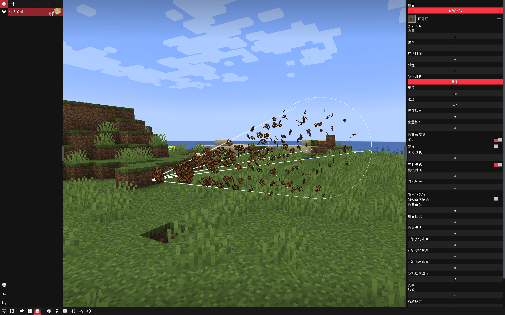
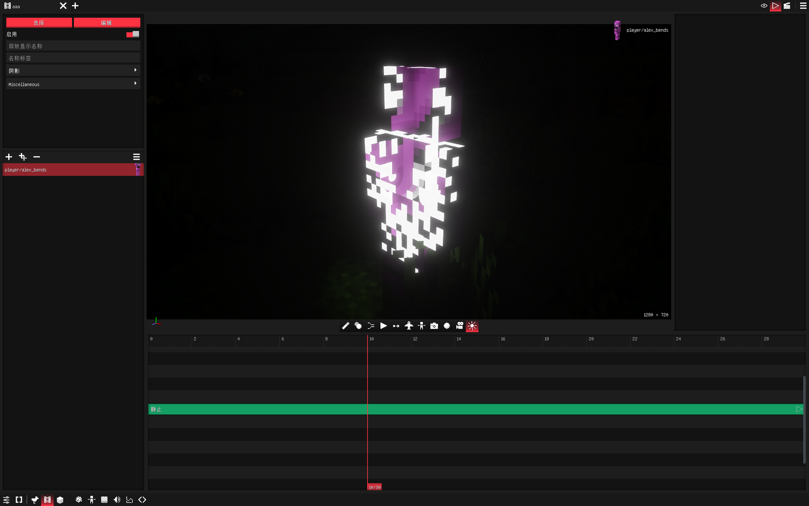

# BBS Cubed

> [BBSFS](https://github.com/Wemppy4/bbs-fs) 功能增强插件

**简体中文** | [English](README_EN.md)

  

## 功能一览

### 可配置项

| 功能                   | 默认 | 说明                                                                                                                         |
| ---------------------- | ---- | ---------------------------------------------------------------------------------------------------------------------------- |
| **BBS增强**      |      |                                                                                                                              |
| 中文关键帧轨道名称     | 关   | 将关键帧编辑器中的轨道名称显示为中文。可通过修改语言文件`bbspp.keyframe.*` 添加/修改翻译，硬编码表兜底                     |
| 编辑器自动切换旁观模式 | 关   | 打开影片编辑器时自动切换到旁观模式，关闭时恢复。                                                                             |
| 禁止出现负数关键帧     | 关   | 开启后，禁止在关键帧编辑器中将关键帧拖动或添加到0秒之前                                                                      |
| Shift直接选择父级      | 关   | 开启后，按住 Shift 在"回放编辑器"、“模型编辑器”中点击模型部位时，将不再弹出层级选择菜单，而是直接选中其父骨骼。            |
| 姿势骨骼树形列表       | 关   | 开启后，姿势编辑器的骨骼列表会按模型父子层级缩进并绘制树形连接线；搜索时仍平铺显示匹配项                                     |
| 第一人称视角晃动       | 关   | 开启后，在播放`第一人称回放` 时，会还原原版的行走视角晃动效果                                                              |
| 全新伪装界面布局       | 关   | 开启后，伪装界面将使用全新的双栏布局。关闭后将使用原版垂直布局                                                               |
| 全新影片库界面         | 关   | 开启后，影片选择界面将使用新版影片库布局和交互                                                                               |
| 反转时间线滚轮方向     | 关   | 开启后，反转影片编辑器中滚轮驱动的时间线方向，包括Ctrl+滚轮移动播放头、Alt+滚轮移动选中关键帧或剪辑，以及Alt滚轮左右滚动时间 |
| 光影控制按钮           | 关   | 在`影片编辑器` 中添加了一个按钮，左键开/关，右键打开`光影选择界面`                                                      |
| 新光影曲线选择界面     | 关   | 开启后，在曲线剪辑里添加光影曲线时使用按光影设置分类的新界面。关闭后使用 BBS 原版平铺列表                                    |
| 关键帧布局深度锁定     | 关   | 开启后，如果`关键帧编辑器` 布局被锁定，左侧轨道名称和右侧轨道之间的调节柄也会隐藏，不再允许调节宽度                        |
| 世界播放应用光影曲线   | 关   | 开启后，使用右Ctrl在世界内播放影片时，曲线剪辑里的太阳、天气、天空色以及Iris光影包参数也会生效                               |
| 允许拖动扩展剪辑轨道   | 关   | 开启后，将整段剪辑继续拖到时间线顶部之外时不再限制轨道层级，可以像原版 BBS 一样创建更多轨道                                  |
| 使用 BBS Cubed 专用剪贴板  | 关   | 开启后，回放、关键帧、形态、变换等 BBS 专用复制数据会保存在 BBS Cubed 内部，不再写入系统剪贴板                                   |
| Alt滚轮时间线行为      | 默认 | 设置影片编辑器关键帧视图中，未选中关键帧时按住Alt滚动鼠标滚轮的行为                                                          |
| **物品喷射**     |      |                                                                                                                              |
| 视野外停止渲染         | 开   | 开启后，物品喷射粒子离开玩家视野时会跳过物品渲染，降低大量粒子时的帧率压力                                                   |
| 最大渲染距离           | 0    | 超过该距离的物品喷射粒子会跳过渲染。设为0时自动跟随客户端视距                                                                |
| 每帧最大渲染数量       | 1024 | 限制每帧最多绘制多少个物品喷射粒子。设为0时不限制                                                                            |
| IRL阴影最大物品数      | 1024 | 开启IRLights光源阴影时，限制最多多少个物品喷射粒子参与投影。设为0时禁用物品喷射投影                                          |
| **Gizmo 改版**   |      |                                                                                                                              |
| Blockbench 风味 Gizmo  | 关   | 开启后Gizmo 显示模式默认改为平移， G/S/R 仅切换 Gizmo 显示模式（无编辑），T 键循环切换模式只切换平移、缩放、旋转            |
| T 键循环含组合模式     | 关   | 使 T 键循环包含 组合Gizmo。仅在上方选项开启时生效                                                                            |
| 保留原版快捷键功能     | 关   | 第 2 次按 G/S/R 不恢复模式，而是执行原版快捷键功能。仅在上方选项开启时生效                                                   |

### AAA粒子

> 前置依赖：需安装 `aaa_particles-2.2.0` + `architectury`，未安装则自动禁用该功能

- 新增 AAA 粒子伪装，粒子文件需存放至 `assets/effeks/` 目录
- 新增指令：`/bbsplusplus aaa_particle trigger <x> <y> <z> <触发器ID>`
  - 示例：`/bbsplusplus aaa_particle trigger 100 64 200 0`（触发指定坐标模型方块粒子的「触发器 0」）
- 已知限制与说明：
  - 功能已通过基础稳定性测试（无崩溃），非崩溃级 BUG 可能不再维护（当前版本已经满足自用需求）
  - 若加载粒子后游戏崩溃：尝试用新版 `Effekseer` 重新导出；如果仍崩溃那我也没招了（

### 物品喷射

  

* 新增 物品喷射 伪装，可以选择多种物品喷射，支持调整的参数如下
  * 物品、数量、频率、存活时间、射程、半径、速度、速度散布、位置散布、重力、碰撞、重力速度、实时模式、模拟时间、随机种子、始终面向镜头、物品俯仰、物品偏航、物品横滚、X轴旋转速度、Y轴旋转速度、Z轴旋转速度、随机旋转速度、缩放、缩放散布、显示辅助线、颜色、发射器形状

### Pose帧增强

- 增加 `pose` 帧多选粘贴功能
- 增加 `骨骼参数刷`，可以复制骨骼参数到另一个骨骼
- 增加 `改动骨骼标识`，有改动的骨骼会有橙色菱形标识提示
- 增加 `跳过当前帧骨骼关键值` ，将鼠标移到骨骼名称右侧边缘会出现菱形，点击即可切换。跳过后仍会保留该骨骼在当前帧的参数，但动画计算会忽略此关键值，直接在前后有效 Pose 帧之间插值；灰色斜线菱形表示已跳过。
- 移植 FS2.5 版本的 `树形骨骼` 功能并优化显示，可选项，默认关

### 附魔光效

- 姿势编辑页新增 `附魔光效` 开关，可为当前选中的骨骼添加原版风格的附魔流光，无限循环无接缝
- 开关下方有 `光效颜色` 取色器，可自定义流光颜色；默认白色 = 原版观感，透明度可顺带调淡光效
- **右键**开关或取色器选择 `应用到子骨骼`，可将状态扩散到该骨骼的全部子骨骼（含从未编辑过的子骨骼）
- 已知限制：**Iris 光影包启用时流光暂不显示**（关闭光影、或仅在编辑器预览时正常）。
  原因是 Iris 对模组自定义核心 shader 存在原理性兼容限制，详见 Iris 文档
  `docs/development/compatibility/core-shaders.md`；后续版本会尝试提供兼容路径

### 结构伪装：

> 合并自 `卫巾纸薄`的`tools`插件

- 增加结构棒、结构伪装
- 后续++会完善：操作优化、群系

### 视频伪装：

> 前置依赖：需安装`MediaPlayer-BBS`，未安装则自动禁用该功能，仅支持**Windows x64**平台！

- 视频文件需放入 `<游戏目录>/config/bbs/assets/video/` 文件夹（支持 .mp4/.mov/.mkv/.webm/.avi/.m4v），可通过伪装编辑器中的"选择视频"面板打开该文件夹
- 兼容说明：`MediaPlayer-BBS 1.0.1` 的 native 时间轴寻帧接口存在崩溃缺陷（部分机器上访问违规），BBS Cubed 会自动禁用其时间轴寻帧退回连续解码路径；`MediaPlayer-BBS 1.0.2+`（修复构建）会自动启用时间轴寻帧，拖动播放头逐帧精确定位。**修复构建发布时请将版本号改为 1.0.2 以上**
- 等待后续完善

### 纹理补间

  

- 新增纹理补间功能，可在纹理关键帧之间平滑过渡，支持三种补间模式：
  - **颜色**：在两张贴图之间按进度平滑插值颜色
  - **像素溶解**：像素按块随机溶解，过渡到下一张贴图
  - **消散**：从扩散起点向外逐块消散
- 消散模式可搭配 `消散倒退`（从透明逐步恢复）、`消散闪白`（变透明前显示闪光颜色，支持自定义颜色与 LabPBR 发光）
- 支持调节像素块大小、扩散强度、闪光颜色、PBR 发光亮度等参数
- 新增 3D `扩散起点拾取器`：在模型表面右键直接拾取消散起点，左键旋转、中键平移、Ctrl+滚轮缩放，X/Y/Z 可数值微调
- 兼容旧版 BBSPPP 纹理补间关键帧数据，自动迁移

### CML 功能（合并自 bbs_snow）

> 原 `bbs_snow`插件全部功能已合并进 BBS Cubed，模组 ID 统一为 `bbsplusplus`，资源命名空间 `bbspp`。安装本模组后无需再单独安装 bbs_snow。

- **流体模拟**：新增流体伪装，支持流体物理模拟渲染
- **粒子Plus**：增强粒子系统——粒子变形(Morph)、碰撞外观与染色、收藏夹浏览器、附加渲染纹理、Additive 材质
- **PBR 纹理分级**：逐骨骼/逐组 PBR 参数覆盖（光滑度、金属度、孔隙率、自发光、法线强度）
- **骨骼纹理**：逐骨骼分配独立纹理
- **Premiere 导出**：将影片导出为 Premiere Pro XML 工程文件，同时生成 SRT 字幕文件
- **三种剪辑类型**：快捷栏剪辑、电影剪辑、重播剪辑，丰富时间线内容
- **动作叠加**：每个模型表单可配置动作叠加层（actions_overlay），支持额外动作槽位，播放时与基础动作混合
- **Additive 动画**：叠加动画支持，多动作层混合计算
- **Molang 变量共享**：variable 动作模型互通开关，开启后不同动作间共享 Molang 变量
- **动画态编辑器**：动画状态编辑与布局增强，支持姿势插入
- **迷你窗口**：可停靠迷你窗口系统（影片面板、仪表盘等），支持拖拽与布局记忆
- **回放时间控制**：重播剪辑支持速度调节、反向播放、传播范围设置
- **剪辑可见性**：剪辑可见性控制，可临时隐藏指定剪辑
- **关键帧编辑器增强**：分割视图、嵌入检查器、动作时间线评估、PBR 关键帧工厂
- **CML 设置面板**：独立设置模块，包含通用、外观、编辑器、显示、流体模拟、模型方块、姿势轨道选择、重播编辑器等分类

### 原版增强

| 功能                         | 说明                                                 |
| ---------------------------- | ---------------------------------------------------- |
| 动画转姿势搜索框             | 动画转姿势窗口添加动画搜索框                         |
| 音效选择器树形列表           | 音效选择器界面以树形结构展示，方便浏览               |
| 双击剪辑编辑(NYK)            | 时间轴上双击剪辑就能进入编辑界面                     |
| 发光色度方块（NYK）          | 添加发光色度方块                                     |
| IRLights插件汉化             | IRLights插件的汉化                                   |
| 改进纹理管理器               | 增加网格模式，增加缩略图                             |
| vfx插件汉化、增强            | vfx插件的汉化、增强                                  |
| 回放类别操作优化             | 增加多选拖拽、重命名类别                             |
| 撤销记录面板改进             | 撤销记录面板显示更易读的操作摘要，并扩大历史弹窗宽度 |
| 光影曲线选择界面改进         | 嗯...                                                |
| 屏蔽ctrl+B打开复述功能       | 莫名其妙的mojang                                     |
| 补全原版图片伪装功能         | 补全UV偏移                                           |
| 光影曲线轨道名称优化         | 合并自tools插件                                      |
| 增加日月偏角和焦点曲线关键帧 | 合并自tools插件                                      |
| ItemStack轨道改进            | 增加变换功能                                         |
| 自动保存预设                 | 模型方块预设增加"自动保存"开关：在IK链、物理骨骼、骨骼限制、姿势页面的预设右键菜单开启后，修改参数会经 500ms 防抖自动写入当前选中的预设，无需手动保存 |

### 原版修复

| 功能                  | 说明                                                                                      |
| --------------------- | ----------------------------------------------------------------------------------------- |
| 输入法冲突修复        | 兼容 IMBlocker，修复在BBS界面下无法切换中文的问题                                         |
| 曲线崩溃修复          | 修复 BBS 2.2 曲线剪辑中开启飞行模式时游戏崩溃的bug                                        |
| 飞行模式曲线修复(NYK) | 打开飞行模式后曲线关键帧的修改依旧生效                                                    |
| 时间轴标尺遮挡修复    | 修复时间轴标尺遮挡导致的关键帧/剪辑片段仍然能被点击的问题                                 |
| 拖动剪辑片段修复      | 修复BBSFS中部分情况下拖动剪辑片段回弹/卡住的问题                                          |
| 播放头偏左问题修复    | 解决wemppy弹道偏左的问题                                                                  |
| 模型贴图错误修复      | 修复在模型贴图名称和模型名称不一致时，BBS可能会使用`_S`等后缀贴图当作默认模型贴图的问题 |
| 颜色膨胀问题修复      | 嗯......                                                                                  |
| 修复光影曲线          | 合并自tools插件，并修复了tools存在的问题                                                  |
| 屏蔽BBS F10黑板功能   | 嗯.........                                                                               |
| 静音问题修复          | 切换音频输出设备时，BBS会出现静音问题                                                     |
| 修复关键帧色条断开    | BBS关键帧相同参数色条会断开                                                               |
| Blockbench步帧动画修复 | 修复 Blockbench 导出的 Bedrock 动画中 step（步阶）关键帧被当作线性插值播放的问题。 |

## 开源许可

- 本项目以 **GNU LGPL-3.0-or-later** 许可证开源，完整许可证文本见 [LICENSE](LICENSE)
- 你可以自由使用、学习、修改和分发本项目，修改后的衍生作品需同样遵循 LGPL-3.0 及其后续版本开源
- 版权所有 (C) 一阵泠风、Gbeic、snowstar
- 本项目是 [BBSFS](https://github.com/Wemppy4/bbs-fs) 的扩展插件，通过 Mixin 实现增强

### MOD更新日志

#### 3.2.2：

* AAA 粒子模块代码清理：
  * 删除 `BBSEffectLoader` 中整套从未被触发的 reload 机制（`requestReload`/`beginReload`/`endReload`/`isReloading`/`canLoadExternalEffects` 及配套字段），以及无调用方的 `preloadExternalEffects`/`isLoaded`/`hasLoadedEffects` 方法
  * 删除 `AAAParticleFormRenderer` 中无调用方的 `getEmitter()` 方法
  * 删除 `BBSPlusPlusModClient` 中因 `beginReload` 永不返回 true 而永远不执行的 reload 代码块
  * 删除旧版 X-Ray 接口残留：`mixin/ParticleEmitterMixin.java`、`util/IIgnoreDepth.java` 及 mixin 配置中的对应注册（当前 X-Ray 由 `XRayManager.migrate()` 实现，该接口已无外部调用）
  * 删除 `EffectDefinitionMixin` 中声明后从未使用的 `EMITTERS_BUFFER` shadow 字段，并更新已失效的类注释
  * 构建验证：`gradlew compileJava` BUILD SUCCESSFUL

#### 3.2.1：

* 翻译同步与修复：
  * 补全 `bbspp/strings/en_us.json` 中 605 个缺失的关键帧轨道英文翻译（VFX特效、物品喷射、视频伪装、光影等轨道）
  * 修复摄像机轨道模式菜单中"跟随轨道"硬编码中文的问题，改为 `bbspp.ui.film.follow_orbit` 翻译key
  * 新建 `assets/xavin/lang/en_us.json`，补全破坏魔杖的英文翻译
* 功能修复：
  * 修复游戏语言为英文时，即使开启"中文关键帧轨道名称"开关，关键帧轨道仍显示中文的问题
  * 根因：关键帧轨道有两条创建路径，第二条路径（`KeyframeTrackStyle.apply()`）走 `localizeWithMap()`，未检查当前游戏语言
  * 修复：在 `localize()` 和 `localizeWithMap()` 中均添加 `isChineseLanguage()` 检查，非中文语言下强制返回英文轨道名
  * 语言检测优先使用 `BBSModClient.getLanguageKey()`（BBS 自身语言设置），回退到 Minecraft `LanguageManager`
* 代码清理：
  * 删除 `UIFilmControllerFollowOrbitMixin` 中未使用的 `IKey` 导入

#### 3.2：

* 伪装界面布局改进：
  * 页面右上角添加排版切换按钮，支持列表模式与网格模式切换
  * 按住 Ctrl + 滚轮可在全页面范围内缩放列表与网格模式的图标大小
  * 列表模式支持并排摆放，最少每行 1 个、最多每行 10 个模型
  * 网格模式下鼠标悬停模型时显示模型名称与模型 ID
  * 拖拽模型到左侧不同分类文件夹时，将模型文件剪切移动到目标文件夹
* Bug 修复：
  * 修复了一些崩溃问题
  * 修复 Blockbench 导出的 Bedrock 动画中 step（步阶）关键帧被当作线性插值播放的问题

#### 3.1.1：

* 功能移除：
  * 移除姿势编辑器中的**纹理调色（texture_tint）**和**纹理美白（texture_whiten）**功能，删除相关 API 接口 `PoseTextureGradeEditorHolder`，精简 `UIPoseEditorMixin` 与 `UIPoseKeyframeFactoryMixin` 中约 200 行相关代码
* Bug 修复：
  * 修复 OrbitViewGizmo 在原版轨道模式下被误隐藏的 bug——根因是 3.1 新增的 `@Shadow controller` HEAD NPE 守卫存在误判风险（controller 实际不会为 null），导致 `isActive()` 被强制返回 false。修复：移除该守卫，改用 `@Accessor` 安全读取目标类字段
* 功能增强：
  * 跟随轨道模式（模式 6）新增 **perspective 右键菜单**支持——在跟随轨道模式下显示与原版轨道相同的右键选项（传送中心到录制点、附加轨道、切换正交），此前仅原版轨道模式（模式 2）有此菜单
* 项目维护：
  * 清理无用嵌套资源目录 `assets/bbs/assets/`（870 个未引用翻译键 + 未引用纹理，含损坏 JSON）
  * 清理临时调试文件（684MB .hprof 内存转储、issue 截图、`_memcheck/`、`mchorse/` 反编译 class）与构建产物（`build/`、`.gradle/`、`run/`），共释放约 2GB
  * 更新 `.gitignore`，添加 `*.hprof`、`issue_screenshot*.png`、`_memcheck/`、`mchorse/` 规则防止回归
  * 构建验证：`gradlew compileJava` BUILD SUCCESSFUL

#### 3.1：

* 合并 `bbs_FSloveCML`（bbs_snow）插件全部内容，卸载 bbs_FSloveCML！
  * 模组 ID 统一为 `bbsplusplus`，资源命名空间统一为 `bbspp`，包名统一为 `gbeic.bbsplusplus`
  * 新增流体模拟伪装、粒子Plus（变形/碰撞染色/收藏夹）、PBR 纹理分级（逐骨骼/逐组 PBR 覆盖）、骨骼纹理
  * 新增 Premiere Pro XML 工程导出 + SRT 字幕导出
  * 新增快捷栏/电影/重播三种剪辑类型、动作叠加层、Additive 动画、Molang 变量共享
  * 新增动画态编辑器、可停靠迷你窗口、回放时间控制（速度/反向/传播范围）、剪辑可见性
  * 新增关键帧编辑器增强（分割视图/嵌入检查器/动作时间线/PBR 关键帧）
* 重构设置面板（6 个分类）：
  * `BBS增强`：原 snow 设置前 4 个开关（中文轨道名/自动旁观/禁止负数关键帧/Shift选父级）+ 原有 BBS++ 选项
  * `增强界面`（新增子分类）：全新伪装界面布局、全新影片库界面、新光影曲线选择界面
  * `物品喷射`、`Gizmo改版`：保持不变
  * `CML扩展`（独立左侧菜单，删除分栏符号）：跟随轨道、骨骼纹理调色等 CML 专属选项
  * `导出增强`（原 premiere-export 改名，独立左侧菜单，删除分栏符号）：Premiere XML 导出 + 音频字幕导出设置
  * BBSCubed 设置模块整体显示在原版 BBS 设置下方
* 功能改善：
  * 跟随轨道（模式 6）现在支持原版轨道的 XYZ 轴方向选择（轨道视图小部件 OrbitViewGizmo 在跟随模式下也会激活）
* Bug 修复：
  * ~~修复姿势页面纹理调色（texture_tint）和纹理白化（texture_whiten）不生效的问题~~（3.1.1 已移除该功能）
  * ~~修复纹理调色/白化在姿势编辑页面可见、退出后不显示的问题~~（3.1.1 已移除该功能）
  * 修复影片编辑器右上角循环图标与可见性图标重叠的问题——循环图标偏移量增加一个可见性按钮宽度
  * ~~修复 OrbitViewGizmo.isActive() 空指针崩溃（controller 为 null 时 NPE）——添加 HEAD null 守卫提前返回 false~~（3.1.1 发现该守卫存在误判 bug 导致原版轨道 Gizmo 被隐藏，已改用 @Accessor 安全读取并移除守卫）
* 设置面板增强：
  * 为「增强界面」「CML扩展」「导出增强」三个分类添加鼠标悬浮介绍（tooltip）
  * 原「CML增强」分类更名为「CML扩展」
* 编译参数调整：因粒子Plus使用 `sun.misc.Unsafe` 注入枚举，编译方式由 `--release 17` 改为等价的 `-source/-target 17 + -XDignore.symbol.file`

#### 3.0：

* 展示名由 BBS++ 更名为 BBS Cubed，版本号升级至 3.0
* 本版本为 一阵泠风、Gbeic、snowstar 合作版本

#### 2.7.2：

* 优化预设自动保存性能：
  * 数据快照改为防抖触发后才构建，拖动滑块时不再每帧全量序列化，消除拖动期间的卡顿与 GC 压力
  * 预设文件写入（序列化 + fsync 写盘）移到后台线程，不再阻塞游戏主线程，松手保存不再掉帧
  * 写盘前增加内容比对，预设数据未变化时直接跳过，避免无效磁盘写入
  * 精简四个页面的自动保存触发点，消除重复触发；切换姿势/模型时自动重置状态，防止挂起任务错写

#### 2.7.1：

* 新增模型方块预设自动保存功能：
  * 在 IK链、物理骨骼、骨骼限制、姿势四个页面的预设右键菜单中添加"自动保存"开关
  * 启用后选中预设，修改参数会经 500ms 防抖自动写入当前选中的预设，无需手动保存
  * 关闭时按钮变暗，开启时高亮；自动保存期间目标预设始终保持选中状态
  * 状态仅在运行时内存中维护，不持久化，每次打开编辑器默认关闭

#### 2.7：

* 合并 `BBSPPP` 模组全部内容，卸载 BBSPPP！
  * 新增纹理补间功能：支持颜色、像素溶解、消散三种补间模式，可在纹理关键帧之间平滑过渡
  * 新增 3D 扩散起点拾取器：可在模型上直接拾取消散效果的起点位置
  * 新增音频字幕导出：视频导出时自动生成带有音频文件名的 SRT 字幕文件
  * 兼容旧版 BBSPPP 纹理补间关键帧数据，自动迁移
* 重构设置界面：
  * BBS++ 设置提升为独立设置模块，在设置列表中显示在 BBS 主设置下方
  * 内部分为三个分类：`BBS增强`、`物品喷射`、`Gizmo改版`，左侧分类栏支持鼠标悬浮描述
  * BBSPPP 选项合并到 `BBS增强` 分类中，移除所有分栏字符（`==============` 假标题）
* 修复设置项翻译 key 前缀，确保所有设置项名称和说明正确显示

#### 2.6.3：

* 新增 `视频伪装` ，依赖前置mod `MediaPlayer-BBS`，目前还有操作方面待完善，仅支持**Windows x64**平台！
* 补全irl 1.1.5版本汉化
* 删除vfx汉化，因为本体已经有了汉化版本
* 补全vfx和vfxlight的关键帧轨道汉化
* 修复vfx着色器报错
* 修复++破坏魔杖改进在新版vfx失效的问题
* 修复vfx和物品喷射冲突的问题

#### 2.6.2：

- 改进 `pose` 帧：增加跳过骨骼当前帧功能
- 优化 `pose` 帧骨骼列表滚动
- 规范化 `/bbsplusplus` 指令
- 改进VFX插件的 `破坏魔杖`操作体验，不拿起时隐藏预览框
- 修复关键帧相同参数色条断开的问题
- 优化++新UI的`默认打开`功能的保存逻辑
- 重构物品喷射伪装
- 屏蔽BBS F10黑板功能
- 增加音频输出设备切换监听，避免切换设备后bbs出现静音的问题
- 增加BBS设置>视频录制界面的视频预设功能

#### 2.6.1：

- 改进 `pose` 帧：增加多选粘贴功能
- 更正关键帧轨道翻译
- 再次修复颜色数组膨胀问题

#### 2.6.0：

- 改进 `pose` 帧
  - 增加 `骨骼参数刷`功能。可以复制骨骼参数到另一个骨骼
  - 增加 `改动骨骼标识`，有改动的骨骼会有橙色菱形标识提示
  - 把FS2.5版本的 `树形骨骼` 功能移植到插件中，并优化显示，可选项，默认关

#### 2.5.9：

- 解决泠风反馈的一个神秘崩溃BUG（他的端太神秘了
- 增加UV偏移功能、顺带补全图片伪装的UV偏移
- 增加alt选中剪辑、关键帧的方向反转到`反转时间线滚轮方向`功能

#### 2.5.8：

* 改进VFX插件的`破坏魔杖`操作体验
* 补充VFX插件缺失的关键帧轨道汉化
* 修复物品喷射粒子与irl之间的兼容性，重新让阴影显示出来

#### 2.5.7：

* 优化运动路径功能的性能问题，不过目前只优化了 `仅当前帧附近`模式
* 暂时移除对BBS历史记录方面的改进，存在BUG

#### 2.5.6：

* 合并 `tools` 插件功能：光影曲线修复、结构伪装。卸载tools、fix！
* 兼容 `Revoxelation` 光影，但存在首次进入存档过曝的问题，转动下视角/重开光影即可恢复

#### 2.5.5：

* 适配2.4版本的FS
* 不再支持之前的版本！！！

#### 2.5.4：

* 新影片库、伪装界面增加`设为默认打开`功能
* 增强 `IMBlocker` 兼容性

#### 2.5.3：

* 全新影片库界面，默认关闭
* 增加异常退出后的游戏模式恢复
* 增加BBS++专用剪切板功能
* 屏蔽ctrl+B打开复述功能

#### 2.5.2：

* 修复剪辑轨道的一个小问题
* 为模型的6条 ItemStack 轨道添加变换功能

#### 2.5.1：

* AAA粒子选择界面窗口大小增加持久化存储
* 优化粘贴剪辑逻辑，不会再粘贴到屏幕外的轨道
* 增加 `允许拖动拓展剪辑轨道` 功能，默认关闭，开启后拖动剪辑向上时，可以扩展出更多条轨道。反馈来自DC一个搭天梯的老外！

#### 2.5.0：

* 增加 `Alt滚轮时间线行为` 功能，三种模式：默认、禁用、左右滚动
* 修复纹理过滤状态恢复问题
* 将`aaa_particles`版本限制在2.2.0/2.2.1，高版本会出现黑屏bug
* AAA粒子选择窗口现在可以拖动大小
* 新伪装界面的首页类别图标现在支持右键自定义
* 现在鼠标在时间轴标尺上可以用鼠标左键拖动播放头了
* 优化剪辑片段拖动

#### 2.4.9：

* 修复 `光影曲线` 和 `Bliss-Shader-Unstable` 冲突的问题
* 为 `新光影曲线选择界面` 增加 `紧凑文件夹` 功能

#### 2.4.8:

* 增加`新光影曲线选择界面`开关
* 现在在`新光影曲线选择界面`下，添加曲线不会关闭界面，而是高亮曲线，再次点击后可取消

#### 2.4.7：

* 增加关键帧轨道定义接口
* 修复外部录制无法正常被撤销的BUG

#### 2.4.6：

> 如果你需要使用 `AAA粒子` 那么就不要安装新版 `aaa_particles` ，会导致黑屏。`bbs++` 与新版 `aaa_particles`不兼容

* 改进bbs的 `光影曲线选择界面` ，也兼容 `tools`
* 改掉wemppy保存最近使用颜色成瘾的坏习惯
* 优化 AAA 粒子
* 增加 `世界播放应用光影曲线` 功能开关，开启后在世界内播放影片时曲线的改动也会生效

#### 2.4.5：

* 现在处于非 `主纹理管理器` 下按esc会直接关闭纹理管理器
* 改进 `撤销记录` 功能，现在能记录的更加细致，同时增加设置项，可以设置最大撤销历史步数

#### 2.4.4：

* 修复 `物品喷射` 碰撞问题
* 改进 `pbr贴图拦截逻辑` 更加健全
* 增加 `剪辑重叠修复器` 改进剪辑碰撞拦截逻辑，更加健全（未测试，因为无法复现BUG）
* 修复 当播放头暂停在 `禁用的镜头剪辑` 边界时仍然生效的问题
* 移除 `物品喷射` 的 `合并停止粒子` 功能

#### 2.4.3：

* 增加 `物品喷射` 更多发射形状
* 增加 `物品喷射` 缩放渐入时间
* 优化 `物品喷射` irl阴影效果

#### 2.4.2：

* 修复`物品喷射` 与irl之间的阴影问题
* 增加最大阴影数量参数

#### 2.4.1：

* `回放类别 `操作优化，增加多选拖拽、重命名类别
* 调整 `物品喷射` 辅助线显示
* 修复 `物品喷射` 开启光影时粒子跟随视野摇晃的bug
* 修复 `物品喷射` 与irl之间的问题

#### 2.4.0：

* 增加 `物品喷射` 伪装
* 增加 `关键帧布局深度锁定` 开关

#### 2.3.5：

* vfx插件汉化

#### 2.3.4：

* 修了俩我没有遇到的bug
* 恢复 `模型贴图错误修复` 功能
* 恢复 `隐藏关键帧标签列宽度调节柄` 功能

#### 2.3.3：

* 解决wemppy弹道偏左的问题
* 为 `全新伪装界面布局` 在另外几个界面打开也增加了 `筛选` 按钮

#### 2.3.2:

* 修复BBSFS中部分情况下拖动剪辑片段回弹/卡住的问题
* 修复我没有遇到的bug......
* 改进纹理管理器，增加网格模式
* 现在可以用 `ESC` 取消BBS的快捷键
* 在新伪装界面添加 `打开模型文件夹` 按钮

#### 2.3.1：

* 增加 `光影控制` 按钮
* 补充 `光影控制` 按钮的设置项

#### 2.2.9：

* 增加 `反转时间线滚动` 功能

#### 2.2.8：

* 适配BBSFS2.3.1
* 移除多余的功能：
  * 删除“精简编辑器循环”功能
  * 删除“布局锁定修复”
  * 删除“模型贴图错误修复”
* 修改：
  * “第一人称视角晃动”功能，启动后屏蔽BBSFS原版的晃动

#### 2.2.6：

* 修复时间轴标尺遮挡导致的关键帧/剪辑片段仍然能被点击的问题
* 补全 `IRLights` 插件汉化

#### ~~2.2.5：~~

* ~~模型贴图错误修复~~

#### 2.2.4：

* 新增 `IRLights` 插件汉化以及关键帧轨道汉化

#### 2.2.3：

* 改进bbsfs原版的 `伪装` 界面UI
* 修复 `AAA粒子` 速度关键帧负数崩溃的BUG，限制在 `0.01-10`
* 改进 `音频`、`AAA粒子` 选择界面的文件排序方式为自然排序

#### 2.2.0：

* 改进循环模式的 `起始帧` 和 `结束帧` ，优化特效播放体验
* 在 `AAA粒子` 编辑界面新增 `智能定格` 开关，用来修复 `起止帧` 相同时的粒子渲染错误；开启后追加一帧，粒子首轮执行完毕后于第二轮暂停。至于为什么是开关？我也不知道我为啥要把它做成开关形式
* `结束帧` 的关键帧现在设置低于 `起始帧` 的数值时会直接强行设置成与 `起始帧` 相同的数值
* `起止帧` 现在最大数值为 `500`
* 增加 `开启第一人称视角晃动` 功能，开启后在播放 `第一人称回放` 时，会还原原版的行走视角晃动效果，但不是100%还原
* 为 `AAA粒子` 增加 `穿透渲染` 的功能，开启后可让 `粒子` 穿透**所有方块、实体**进行渲染，由于不是靠 ` aaaparticles` 本身实现的，**性能可能会有点小损失**
* 修复在安装了 `Sodium` 后 `AAA粒子` 在第一人称视角下会透过右手渲染的问题。**如果同时开启** `穿透渲染` **和** `光影` **那依然会存在这个bug**

#### 2.1.2：

* 优化 AAA 粒子，相较上个版本，足足压缩了高达 **1KB** 包体！！

#### 2.1.1：

* 改进  `Shift直接选择父级` 功能，现在在 `模型编辑器` 界面也可以使用
* 修复 `AAA粒子` 循环模式下闪烁的问题
* 为 `AAA粒子` 增加 `起始帧` 和 `结束帧` 的关键帧，可以更精准的控制循环，解决粒子循环模式下无法无缝衔接的问题（比如魔法阵）

#### 2.0.7：

* 修复 `BBS++` 与 `PoseCurve` 插件的兼容问题

#### 2.0.5：

* 改进 `BBSFS` 在 `摄像机编辑器` 中按快捷键 `L` 打开循环模式后 `状态图标` 的显示位置，并为其增加了点击关闭的功能

#### 2.0.4：

* 修复崩溃BUG：当世界存在 `AAA粒子` 时，装载/卸载资源包时崩溃的BUG
* 新增 `Shift直接选择父级` 功能

#### 2.0.0：

- 增加AAA粒子伪装

#### 1.6.3：

- 打开飞行模式后曲线关键帧的修改依旧生效(NYK)

#### 1.6.2：

- 修复在编辑器自动切换冒险模式时控制演员没能成功切换模式的问题
- 时间轴上双击剪辑就能进入编辑界面(NYK)
- 修复 BBS 2.2 曲线剪辑中开启飞行模式时游戏崩溃的bug

#### 1.6.0：

- 修复了锁定布局后依然能拖动窗口的bug
- 增加了BB风味的gizmo的交互（可开关）
  - 快捷键G/S/R仅切换模式，移除多次按下后的编辑（可选）
  - 快捷键T循环切换 平移/缩放/旋转 三种模式，也可以通过设置开启FS原版的 组合 模式，变成四种模式循环

#### 1.5.0：

- 修正了几个关键帧名称的汉化
- BBSFS升级到2.2.1后关闭插件的NBT修复

#### 1.4.0：

- 增加LumenCore插件的关键帧名称汉化
- 进入摄像机界面自动切换旁观者模式
- 改进音效选择界面

#### 1.0.0：

- 改动'循环切换编辑器'快捷键" ~ "功能，原本是三个界面来回切换，我改成了只切换摄像机、回放。可以开关
- 增加动画转姿势界面的搜索功能
- 修复安装了输入法冲突修复(IMBlocker)在BBS界面没办法切换中文的问题
- 增加了关键帧名称的中文，也可以通过mod内的json( assets\bbs\assets\strings )自己改。可以开关
- 修复物品关键帧丢失详细NBT的bug
