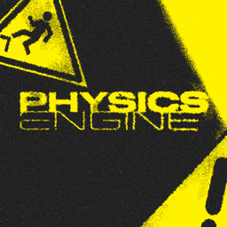

<div align="center">



# BBS Physics Engine

**Real physics for [BBS](https://github.com/Wemppy4/bbs-fs) films.**
One world per scene, stepped once per tick — so every crate, rope, cape and fallen
character finally sees all the others.

</div>

---

BBS animates by keyframes, and keyframes are honest work: they do exactly what you drew. This
addon adds the other half — a physics engine that takes over the moment you want something to
*fall*, *swing*, *drag* or *give way*, and hands the scene back to your animation the moment you
want it back.

Nothing here replaces your animation. Every object has one handle — **Animation** — and you
keyframe it like anything else. At **1** the object walks your keys exactly. At **0** it is on
its own. Sliding it from 1 to 0 on the timeline is how a character is knocked out, how a held
crate is let go, how a rope is dropped. That single idea is most of the mod.

## What it adds

### 🧱 The Collision tab — teaching a form its shape

Before anything can be hit, it needs a shape. Every form gets a **Collision** tab where its bones
are marked up. Press **Mark up automatically** and it drafts the whole model in one go; fix what
it got wrong.

| Mode | What it means |
|---|---|
| **Nothing** | The bone is not there for physics. The default. |
| **Auto from cubes** | A box per cube, measured from the geometry. |
| **By pixels** | The *painted* pixels become thin plates — a lock of hair on a flat card collides where the strand is drawn, not across the whole card. |
| **Shapes by hand** | Boxes, spheres, capsules and cylinders you place yourself. |

Every mode but the manual one is live: repaint the texture or edit the model and the collision
follows. Markup can be copied, pasted and saved as a preset.

> **A marked-up form is already solid.** Crates, cloth, hair and fallen characters collide with
> it without any modifier at all. Modifiers are only for things that move *on their own*.

### ⚙️ The Physics tab — modifiers

| Modifier | For |
|---|---|
| **Rigid body** | A crate, a sword, a prop, a whole passive set piece. Mass — or pick a material and let it be weighed — friction, bounciness, damping, per-axis freezing of travel and spin. |
| **Ragdoll** | A character that falls. Per-bone joints — cone for shoulders and hips, hinge for knees and elbows, welded to fuse pieces into one — with spread and twist limits, and **muscles**: how hard the body keeps fighting for its animated pose. 0 is a corpse, halfway is stunned or drunk. |
| **Chain** | Hair, tails, braids, ropes. Ticks the bones straight off the model's own chain description, then takes them over from BBS's chain solver. Stiffness falls off towards the tip, which is what makes hair read as hair rather than as a chain. |

### 🎈 New forms

**Cloth** — a hanging sheet held by an edge, by its top corners, or by nothing; it folds, flutters
and catches on the world, on bones and on props. **Balloon** — an inflatable ball with a skin,
dented by whatever it lands on, weightless or lighter than air if you want it to rise.
**Chain** — a strand of any form repeated seam to seam; its top hangs from wherever you place it,
and its bottom end is tied to an actor's bone by the **attach** track on the timeline. Tie a rope
to a crate carrying a Rigid body modifier and it honestly drags the crate.

### 🎬 Timeline clips

**Impulse** — a blast away from a point, or a shove along a direction: strength, radius, and a
button that takes the point straight from your crosshair. **Tear a bone off** — a ragdoll bone
leaves the body at that frame and stays with physics for the rest of the film, with a kick if you
want one.

Neither outranks your animation: an object whose Animation handle is at 1 belongs to the
keyframes, and no blast moves it.

### 🔥 Bake to keyframes

At the bottom of the Physics tab. The computed simulation is written into the replay as ordinary
keyframes — only on the ticks where physics actually moved something, with still stretches
collapsed to two keys and your own keys outside those stretches left alone. The Animation handle
goes to 1, the animation owns the form again, and every key can be dragged by hand. Undone like
any other edit of the film.

## Quick start

1. **Settings → Physics → Enable physics.**
2. Open the form editor for the thing that should fall. In the **Collision** tab press
   **Mark up automatically**.
3. Go to the **Physics** tab → **Add a modifier** → **Rigid body**, or **Ragdoll** for a
   character.
4. Scrub the timeline. Physics is computed ahead in the background; the strip under the timeline
   fills in as it goes, and a frame that is not computed yet simply shows your plain animation.
5. To let the object go mid-shot, keyframe **Animation** from 1 down to 0.
6. Happy with it? **Bake to keyframes**, and it becomes ordinary animation.

## Requirements

* Minecraft with **Fabric Loader** and **Fabric API**
* **Java 17** or newer
* **[BBS](https://github.com/Wemppy4/bbs-fs)** — this is an addon, it does nothing on its own

There are no prebuilt downloads: BBS itself is not published to a public repository, so both are
built from source. See [Building](#building).

### Branches

One branch per target, each building against its own BBS.

| Branch | Minecraft | Built against |
|---|---|---|
| `master` | 1.20.1 – 1.20.4 | BBS 2.4 |
| `1.21.1` | 1.21.1 | BBS 2.5.2 |
| `1.21.11` | 1.21.11 | BBS 2.5.2 |
| `cml-1.21.1` | 1.21.1 | BBS CML 2.1-RC4 |
| `cml-1.20.4` | 1.20.4 | BBS CML 2.1-RC4 |
| `cml-1.20.1` | 1.20.1 | BBS CML 2.1-RC4 |

The `cml-*` branches target BBS CML — a different fork of the same mod, with the same mod id. On
Minecraft 1.20.1 the plain BBS branch has to be new enough to carry the `bbs-client-addon` entry
point, or the client half of this addon will not load.

### Settings

Under **Physics** in BBS's settings: the master switch — off, and the addon costs nothing —
gravity, where half of Earth's reads as slow motion without touching a single keyframe; collision
sub-steps; how many blocks of the world around, below and above the scene take part; and a debug
overlay that draws the shapes the simulation actually works with.

## Building

BBS is not published to any public repository, so it has to be put into the local Maven
repository first:

```sh
cd ../bbs-fs
gradlew publishToMavenLocal
```

That installs the `mchorse:bbs` version that `bbs_version` in `gradle.properties` points at into
`~/.m2`. Repeat it whenever BBS changes in a way this addon depends on.

BBS keeps the same version string while it is being developed, and Loom caches remapped mod
dependencies by coordinates — so a republished BBS would normally go unnoticed. This project's
`build.gradle` drops the stale remap by itself, so a plain `gradlew build` is enough after
republishing; `--refresh-dependencies` is not needed.

Then, in this project:

```sh
gradlew build      # the jar lands in build/libs/
gradlew runClient  # starts the game with both BBS and this addon loaded
```

Note that this dev client runs BBS **without Sodium and Iris** — they are compile-time
dependencies of BBS, not of this project, and pulling them in transitively was turned off. BBS's
mixins that target them log a warning and are skipped. To test anything that touches rendering
under shaders, add them here as `modLocalRuntime` first.

## How it plugs into BBS

BBS loads addons through two entry points: it instantiates the listed classes and scans them for
methods annotated with `@Subscribe`, which then receive BBS's registration events.

* `bbs-addon` → `BBSPhysicsAddon` — read on both sides, at the top of BBS's own initialization.
  It registers the addon's asset source pack.
* `bbs-client-addon` → `BBSPhysicsClientAddon` — read on the client only, before any client-side
  event is posted. It lives in the client source set, so BBS's client-only event classes are
  never loaded on a dedicated server. It registers the language files and the settings module.

Beyond the events, BBS's factories are reachable statically — `BBSMod.getForms()`,
`BBSMod.getFactoryCameraClips()`, `BBSMod.getFactoryActionClips()` — so new form types and clip
types can be registered from the addon's own initializer, which Fabric runs after BBS's.

## The engine

[Jolt Physics](https://github.com/jrouwe/JoltPhysics), through
[jolt-jni](https://github.com/stephengold/jolt-jni). It was picked over PhysX, Bullet and ode4j
for three things an animation tool needs and the others don't have together:

* it drives a ragdoll towards an animated pose (`Ragdoll.driveToPoseUsingKinematics`), which is
  what physics in BBS is *for* — the animator owns the pose, physics only adds to it;
* it saves and restores the whole world's state (`PhysicsSystem.saveState`), which is what makes
  scrubbing a timeline honest: a tick has to look the same however it was arrived at;
* it simulates soft bodies on the CPU, so cloth and rope don't depend on the graphics card.

The native library is bundled for Windows, Linux, Linux on ARM and both Macs, and rides into the
mod jar through jar-in-jar. `JoltNatives` unpacks the one this platform needs into
`<game>/bbs_physics/natives` — under a name carrying a hash of its content, so it is written once
and a new build of Jolt never has to overwrite a library another copy of the game holds open.

Anywhere else — an unsupported platform, an unwritable disk — `JoltEngine.available()` reports it
once and answers `false` forever after. A missing feature is a much better outcome than a game
that will not start, so nothing here is allowed to be fatal.

## License

MIT.
